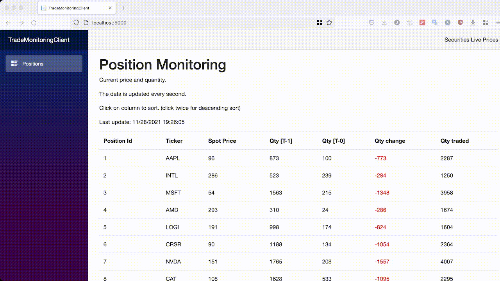

# Trade Monitoring - Client

Connect to server monitoring trades of securities (server-side) and displays data as a website. When connected by websocket to server, the server will push update every second.

## Preview



### How to run

```
dotnet run watch
```

### Multiple instances
You can run the app and open multiple tabs. Data will be shared between them.

### How to run tests

```
dotnet test
```

### TODO
Things I did not have time to implement but could use improvement:
- unit tests